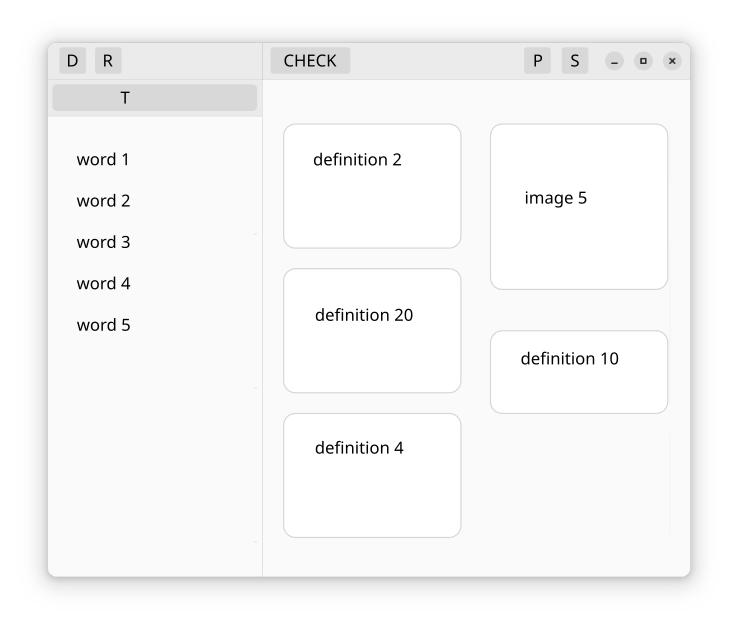

# Lexicon Trainer

**Lexicon Trainer** is a Gnome GTK app designed to train vocabulary around a user-defined dictionary database.

*This README is currently work in progress.*

# Use-case example

**Lexicon Trainer** was born out of unsatisfactory experience with open-source flashcard software. The focus of the application is on the training of a given flashcard deck, rather than the design of the deck itself. The design of the deck/database is given for granted, and loaded into the application with a database. See the project **md2db** for a systematic way of building custom dictionaries.

## Vocabulary expansion 

The original intent for **Lexicon Trainer** was English vocabulary expansion around custom word/idiom dictionary created while reading books. 

For such task, the dictionary database contains at least 2 columns:  `word/idiom` and `definition`.

**Lexicon Trainer** randomly draws a set of $n$ samples of the form (word, definition) from the database and displays them in random fashion on the application interface. The user trains the dictionary by recalling ans correctly matching words to their definition.

*Training difficulty level is discussed below in section: Future developments*.

## Exams revision

Another possible application of **Lexicon Trainer** would be the revision of any kind of (text/image-based) definitions for academic exams. Such application might be of interest for a number of disciplines: medical school, law school, math (render $\LaTeX$ as image).

*If you are interested in exploring such application, your contribution is welcomed*

# Code Base

specification

## Graphical user interface
Mock-up inspired from Gnome Settings application

1. The user starts the application and loads a dictionary database with the button (D). Once the database is successfully retrieved, the training can start.
2. The training session can be started/paused/stopped with the button (P)
3. During the training session, the user selects a word from left panel and a definition from the right panel. The tuple (word, definition) is checked with the button (CHECK):
	* if the match is correct, the tuple (word, definition) is removed from the panels and new random tuple is displayed.
	* if the match is incorrect, either the word or the definition are replaced with a new one
4. During the training session, if the user believes that the word corresponding to a given definition is missing, he/she can type the word in the text input field (T) and perform the check with the button (CHECK)
5. During the training, the currently displayed words and definition can be refreshed with the button (R)

The user can access application settings with the button (S)

## Pseudo-code

description of the logic and callbacks

## Python implementation

Dependencies:

# Future development

Differentiate training difficulty:
+ the definition of a word appearing on the left might not be present on the right panel. In the settings there might be a percentage parameter that quantifies the number of *noisy* definitions that are present on the right panel. The user can enter the word matching a *noisy* definition on the text input (T)
+ number of words and definitions that are randomly shown at a given time

Add statistics on a certain deck. Possibly implement a home screen that prompts the user with a choice of recent decks and related statistics

Add a timer/counter as training sessions. The user should be able to:
+ train for a certain amount of time and maximize the number of correct word-to-definition matches
+ train for  certain number of matches in the quickest time possible

Handle different types of definitions  (this relates to the database structure)
+ with only images
+ with text and embedded images

At the end of a session, the user should be able to see the wrong matches against the correct definition.

Port the code base in Rust, consider if worth moving to GTK4.
